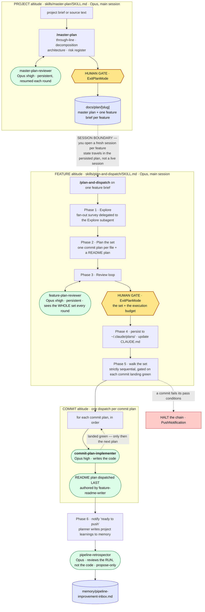
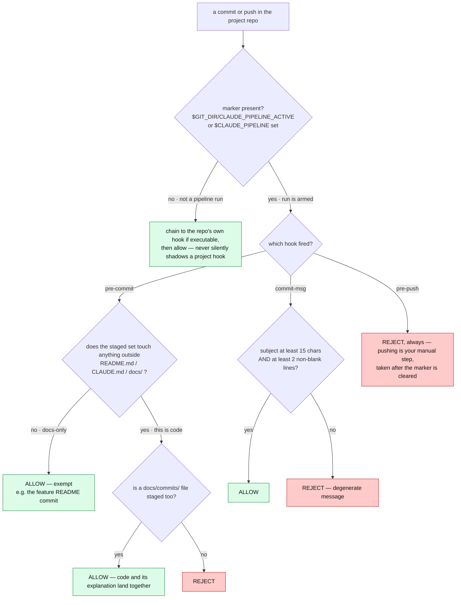
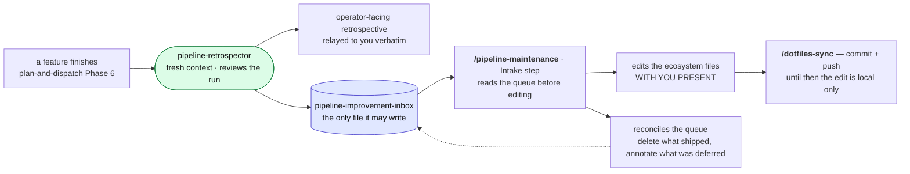

# The planning pipeline — a visual map

**This file is a map, not an agreement.** It shows the shape of the ecosystem: who dispatches whom,
where the human gates sit, what each artifact path is. It carries **no rule of its own** — every
rule is owned by the file named beside it (`skills/*/SKILL.md`, `agents/*.md`, `hooks/*`). When
the map and a governing file disagree, the file wins and this map is stale.

To change anything in the ecosystem, invoke **`/pipeline-maintenance`** — it carries the editing
discipline and the cross-file dependency graph.

> Verified against the files on **2026-07-28** (Claude Code 2.1.220). Mechanically re-checkable
> with `sh ~/.claude/skills/pipeline-maintenance/validate-config.sh`.
>
> Ecosystem files are distributed through the `~/.dotfiles` bare repo — an edit is not live
> anywhere else until `/dotfiles-sync` has pushed it.

---

## 1. The 30-second version

The pipeline runs the ladder **project → feature → commit**. Everything is automated except four
human steps:

| # | You do | Then the pipeline |
|---|--------|-------------------|
| 1 | Fresh session → **`/master-plan`** on the brief → approve at `ExitPlanMode` | Persists the master plan + one **feature brief** per feature to `docs/plan/` |
| 2 | **A new session per feature** → **`/plan-and-dispatch`** on that brief → approve the commit-plan set **and its execution budget** at `ExitPlanMode` | Runs unattended: dispatches every commit, gating each green before the next |
| 3 | Wait for the **"ready to push"** notification → review the local commits → **push by hand** | Nothing — the guard blocks a *dispatched implementer* from pushing, deliberately |
| 4 | **`/pipeline-maintenance`** when the improvement inbox has items | Reads the inbox, asks what it must, plans, then applies the proposals **with you present** and pushes them via `/dotfiles-sync` |

Step 2's `ExitPlanMode` is **the only gate between a plan and code being written**.

---

## 2. End to end



**Reading it:** rounded green = subagent, yellow hexagon = human gate, cylinder = durable artifact.
The dotted line between altitudes is a real session boundary — `master-plan` names the next feature
and stops.

---

## 3. Who owns what — the altitude contract

Each rung owns exactly one thing and copies nothing from another. A copy upstream is not a head
start; it is a second source of truth that drifts the moment the real one is decided.

| Rung | Owns | Must never contain | Artifact |
|------|------|--------------------|----------|
| **master-plan** | Through-line · decomposition into features · repo architecture · cross-cutting conventions · risk register · falsifier per feature · a per-feature **delta** (modules added/altered/removed, and every shipped guarantee the feature means to break) | Call signatures, schemas, code bodies, stubs, tolerances, sample sizes — a delta names **modules, never signatures** | `docs/plan/[slug]` |
| **plan-and-dispatch** | Decomposition into commits · the **contract surface** between them · pre-resolved decisions *with rejected alternatives* · each test's **intent / target / method class / discrimination** · a declared **delta** where a commit alters shipped behavior · the effort estimate · the `docs/commits/` path | Code bodies, **test mechanics** (expressions, fixtures, grid sizes, loops), numeric bounds and tolerances | `~/.claude/plans/*.md` |
| **commit-plan-implementer** | **Code bodies** · **all test mechanics** · **every numeric bound**, derived **theory-first** · verification · the commit itself | — (it reads only its one plan; never the master plan or sibling plans) | the git commit |

The reason the plan carries no code: a pre-written body turns the implementer into a transcriber
that stops checking whether the code integrates, and grounds "final" code in infrastructure that
does not exist yet. The safety net is the **pinned test target and discrimination margin** plus the
implementer's verification loop. *(Owned by `skills/plan-and-dispatch/SKILL.md` — "What the plan
pins".)*

**Measurement splits by question, not by rung.** The planner may run code while planning, against
infrastructure that **already exists**, for one purpose only: certifying that a gate discriminates
and that a negative control genuinely fails — because that answer can add or delete a commit, and the
implementer (reading one plan) cannot see across the set. It writes the **margin**, never the
tolerance. Every `atol` / `rtol` / SE multiple / sample size is the implementer's, derived against
real code. *(Owned by `skills/plan-and-dispatch/SKILL.md` — "Measuring during planning".)*

---

## 4. Inside one commit

```mermaid
sequenceDiagram
    autonumber
    participant PAD as plan-and-dispatch · Opus
    participant IMP as commit-plan-implementer · Opus
    participant REV as commit-code-reviewer · Opus, read-only
    participant DOC as commit-doc-writer · Opus
    participant GIT as git guard hooks

    PAD->>IMP: one commit plan — goal, contract surface, decisions,<br/>test intent + discrimination, pass conditions, the docs path
    Note over IMP,GIT: SubagentStart arms the git guard here,<br/>SubagentStop disarms it — nobody arms it by hand
    Note over IMP: reads ONLY this plan plus the project's<br/>CLAUDE.md / README.md — never a sibling plan
    IMP->>IMP: write the tests first
    IMP->>IMP: MUTATION GATE — a test that passes before the<br/>feature exists is vacuous; rewrite it
    IMP->>IMP: implement · own the mechanics · derive bounds theory-first
    IMP->>IMP: verify empirically — ONE synchronous gated run,<br/>foreground, exactly once
    IMP->>REV: the diff, its goal, contracts, test intent
    REV-->>IMP: findings organised by objective — no write tools
    IMP->>IMP: fix every reasonable finding<br/>re-dispatch once if the fixes were substantial
    IMP->>DOC: context bundle — a superset; the writer selects
    DOC-->>IMP: docs/commits/[feature]/[NN]-[commit].md
    IMP->>GIT: stage code + that doc, then one descriptive commit
    GIT-->>IMP: pre-commit and commit-msg checks run here
    IMP-->>PAD: handoff — landed, ALL GATES: PASS, doc path, deviations
```

Three things this diagram is making visible:

- **The implementer is the only node with write access to the repo**, and it makes the most
  judgment calls of any of them — it owns the code, the test mechanics, and every numeric bound.
  Its agreement is deliberately the tersest and most imperative file in the ecosystem.
- **The independent review is a control, not ceremony** — it exists because the built-in
  `/code-review` command stopped being model-invocable, and the pipeline briefly ran with no
  independent review at all.
- **The implementer never pushes, and never returns mid-workflow.** It hands back a summary;
  `plan-and-dispatch` gates the next commit on it and does *not* re-run the expensive experiment as a
  second ground truth. A dispatch that returns *without* its commit landed is resumed, not halted and
  not re-dispatched cold.

---

## 5. The git guard

Three POSIX-sh hooks in `~/.claude/hooks/`, pointed at by `git config core.hooksPath` and gated on a
repo-local marker file so they are **inert in every other repo and every non-pipeline commit**. A
fourth script, `pipeline-marker.sh`, owns the marker's lifetime.



**Marker lifecycle — nobody arms it by hand.** `hooks/pipeline-marker.sh` is wired in
`~/.claude/settings.json` as a `SubagentStart` hook (arm) and a `SubagentStop` hook (disarm), both
matching `^commit-plan-implementer$`. The guard is therefore live for exactly the window in which a
dispatched implementer is touching the repo: **your own pushes are never blocked between commits,
and a halted run cannot strand an armed marker.** The arm step also points the repo at these hooks,
unless the repo already sets its own `core.hooksPath` — then it leaves it alone and warns that the
guard is not enforcing.

**Why a marker file and not an env var:** each Bash call runs in a fresh shell, so nothing in the
session environment can reach a dispatched implementer. The git layer can. (`settings.json` hooks
*do* now fire on subagent tool calls, and their payload carries `agent_type` — which is what makes
the lifecycle above possible. Enforcement stays at the git layer because it catches a commit by any
route, not only one made through Bash.)

---

## 6. Where everything lands

| Path | Written by | Read by | Notes |
|------|-----------|---------|-------|
| `docs/plan/[slug]` | `/master-plan` (after approval) | `/plan-and-dispatch`, you | Master plan + the feature briefs; **crosses the session boundary**, so each brief has to stand alone for a cold reader |
| `~/.claude/plans/*.md` | `/plan-and-dispatch` Phase 4 | the execution loop | One file per commit plan, plus the README plan; the checkpoint the loop walks |
| `docs/commits/[feature]/[NN]-[commit].md` | **authored** by `commit-doc-writer` | maintainers | **Four owners, one path:** the planner *names* it (template §8), the writer *authors* it, the implementer *stages and commits* it, `pre-commit` *enforces* it |
| feature `README.md` | `feature-readme-writer` | newcomers, evaluators | Dispatched **last**, once every commit has landed; a docs-only commit, so guard-exempt and it gets no `docs/commits/` file |
| `memory/*.md` + `MEMORY.md` | the planner (project learnings, Phase 6) | future sessions | Learnings about the *codebase* |
| `memory/pipeline-improvement-inbox.md` | `pipeline-retrospector` | `/pipeline-maintenance` | Learnings about the *pipeline* — see below |

---

## 7. How the pipeline improves itself



The retrospector **proposes only** — it never edits an ecosystem file. Those files govern every
future run and a run closes unattended, so an edit there would change pipeline behaviour with nobody
reading the diff. An item left in the inbox resurfaces next cycle; that is the point.

---

## 8. File index

| File | Role | Model · effort | Reads | Dispatches / writes |
|------|------|----------------|-------|---------------------|
| `skills/master-plan/SKILL.md` | Project planner | main session · Opus | brief, source text, codebase | `master-plan-reviewer`, `Explore` → `docs/plan/` |
| `skills/plan-and-dispatch/SKILL.md` | Feature planner + execution loop | main session · Opus | one feature brief, codebase | `feature-plan-reviewer`, `Explore`, `commit-plan-implementer` ×N, `pipeline-retrospector` → `~/.claude/plans/` |
| `skills/pipeline-maintenance/SKILL.md` | Meta-skill: edits the ecosystem | main session · Opus | the inbox, then the ecosystem files | the ecosystem files, the memories → `dotfiles-sync` (its Phase 6) |
| `skills/dotfiles-sync/SKILL.md` | Distributes the ecosystem | main session · Opus | the `~/.dotfiles` bare repo | the commit + push that makes an ecosystem edit live elsewhere |
| `agents/master-plan-reviewer.md` | Critic of the master plan | Opus · xhigh | the plan | reports only · **persistent, resumed each round** |
| `agents/feature-plan-reviewer.md` | Critic of the whole commit-plan set | Opus · xhigh | the whole set, every round | reports only · **persistent, resumed each round** |
| `agents/commit-plan-implementer.md` | Executes one commit plan | Opus · high | its one plan + project docs/code | `commit-code-reviewer`, `commit-doc-writer`, `feature-readme-writer` → code + one local commit |
| `agents/commit-code-reviewer.md` | Independent review of one diff | Opus · high · **read-only** | the working diff | reports only · **one-shot per commit** |
| `agents/commit-doc-writer.md` | Authors the per-commit doc | Opus · high | one diff + the bundle | `docs/commits/...` · does not stage or commit |
| `agents/feature-readme-writer.md` | Authors the showcase README | Opus · high | the whole finished feature | `README.md` · does not stage or commit |
| `agents/pipeline-retrospector.md` | Retrospective on the run | Opus · high | run artifacts + ecosystem files | the inbox memory **only** |
| `skills/reviewer-core/SKILL.md` | Shared review discipline | — | **preloaded** into `master-plan-reviewer` + `feature-plan-reviewer` via their `skills:` frontmatter | — · deliberately **not** preloaded into `commit-code-reviewer`, which is one-shot, not resumed |
| `skills/writer-core/SKILL.md` | Shared doc craft | — | **preloaded** into `commit-doc-writer` + `feature-readme-writer` | — · the rushed-team-lead reader, folding, signal hierarchy, the stand-alone evidence bar |
| `skills/handoff-core/SKILL.md` | The four handoff **bundles** | — | **preloaded** into `commit-plan-implementer` + the four receivers; `plan-and-dispatch` **invokes** it (a skill cannot preload a skill) | — · sender writes every field incl. `none`; receiver names any gap and proceeds |
| `skills/pipeline-maintenance/validate-config.sh` | Schema + cross-reference check | POSIX sh | `agents/*.md`, `skills/*/SKILL.md`, `settings.json` | exit 1 on an unresolvable reference · run by post-edit check 6 **and** `plan-and-dispatch` Phase 1 |
| `hooks/pre-commit`, `pre-push`, `commit-msg` | The git guard | POSIX sh | the staged set / the message | allow or reject · marker-gated, see §5 |
| `hooks/pipeline-marker.sh` | Arms/disarms the guard | POSIX sh | — | wired in `settings.json` as `SubagentStart`/`SubagentStop` on `commit-plan-implementer` |

---

## 9. Something went wrong — where to look

| What you see | Where it comes from |
|--------------|---------------------|
| `pre-push: push blocked during a pipeline run` | An implementer dispatch is still running, so the guard is armed. If nothing is running, a `SubagentStop` hook did not fire: clear `$(git rev-parse --git-dir)/CLAUDE_PIPELINE_ACTIVE` by hand |
| `pre-commit: stage this commit's docs/commits/ file` | A code commit without its doc. Owner: `hooks/pre-commit` + the path pinned in the plan's §8 |
| `commit-msg: write a descriptive commit message` | Subject under 15 chars, or no body. Owner: `hooks/commit-msg` + the implementer's commit conventions |
| Commit docs feel bloated or same-weight throughout | `skills/writer-core/SKILL.md` (scannability, folding, the cut list) and `agents/commit-doc-writer.md` (what belongs in a commit doc at all) |
| A plan contains code bodies, test expressions, or tolerances | The altitude contract — §3 above; owners are `master-plan` and `plan-and-dispatch`. `feature-plan-reviewer` is required to fault their *presence*, not only their absence |
| An implementer preserved something redundant "because the plan pinned it" | Plan-stated mechanics are the implementer's to replace. Owner: `agents/commit-plan-implementer.md` — "Plan-stated mechanics are yours" |
| A subagent reports `/code-review` or `/verify` failed with `disable-model-invocation` | Expected: both are user-triggered only. `commit-code-reviewer` replaces the first; drive the flow directly instead of the second |
| `pipeline-marker: this repo sets core.hooksPath=…` | The repo owns its hooks path, so the guard is **not** enforcing. Owner: `hooks/pipeline-marker.sh`; arm it by hand if you want it |
| A reviewer or writer ignores its shared core | The `skills:` preload was skipped (missing/renamed core, or one that set `disable-model-invocation`) and it only warns in the debug log. Owner: `skills/reviewer-core/`, `skills/writer-core/`, `skills/handoff-core/` — and `validate-config.sh` is what catches it before a run |
| An agent says its bundle was missing a field | Working as designed: the receiver names the gap and proceeds. The sender dropped it. Owner: `skills/handoff-core/` for the field set, the sending agreement for filling it |
| `/plan-and-dispatch` opens by reporting a config failure | `validate-config.sh` found an unresolvable reference — a renamed agent, a core that no longer loads, a dead hook path. Fix it in `/pipeline-maintenance`, not mid-run |
| A commit seems to have stalled | Check the plan's §0 **agent wall-clock** estimate — not its compute figure, which is far smaller and makes every healthy dispatch look stalled. The run is *supposed* to be long for gated experiments |
| A dispatch came back saying it is "waiting" for a subagent | It should never do that. Owner: `agents/commit-plan-implementer.md` — "Never return in a waiting state"; the dispatcher's side is `plan-and-dispatch` Phase 5, which verifies the tree and **resumes that same session** |
| The pipeline keeps repeating a mistake across features | It belongs in the inbox → `/pipeline-maintenance`, not in a one-off correction to a running agent |
