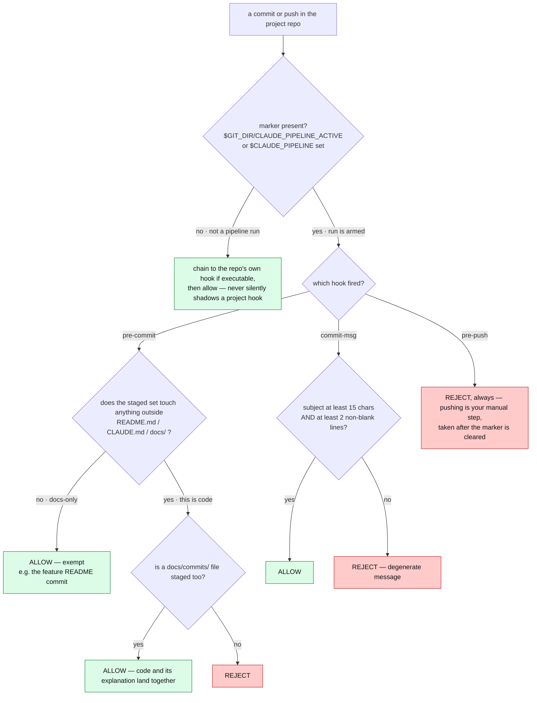
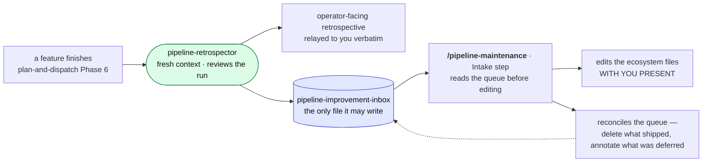

# The planning pipeline — a visual map

**This file is a map, not an agreement.** It shows the shape of the ecosystem: who dispatches whom,
where the human gates sit, what each artifact path is. It carries **no rule of its own** — every
rule is owned by the file named beside it (`skills/*/SKILL.md`, `agents/*.md`, `shared/*.md`,
`hooks/*`). When the map and a governing file disagree, the file wins and this map is stale.

To change anything in the ecosystem, invoke **`/pipeline-maintenance`** — it carries the editing
discipline and the cross-file dependency graph.

> Verified against the files on **2026-07-25**.

---

## 1. The 30-second version

The pipeline runs the ladder **project → feature → commit**. Everything is automated except four
human steps:

| # | You do | Then the pipeline |
|---|--------|-------------------|
| 1 | Fresh session → **`/master-plan`** on the brief → approve at `ExitPlanMode` | Persists the master plan + one **feature brief** per feature to `docs/plan/` |
| 2 | **A new session per feature** → **`/plan-and-dispatch`** on that brief → approve the commit-plan set **and its execution budget** at `ExitPlanMode` | Runs unattended: dispatches every commit, gating each green before the next |
| 3 | Wait for the **"ready to push"** notification → review the local commits → **push by hand** | Nothing — the guard blocks pushes, deliberately |
| 4 | **`/pipeline-maintenance`** when the improvement inbox has items | Applies the retrospector's proposals with you present |

Step 2's `ExitPlanMode` is **the only gate between a plan and code being written**.

---

## 2. End to end


**Reading it:** rounded green = subagent, yellow hexagon = human gate, cylinder = durable artifact.
The dotted line between altitudes is a real session boundary — `master-plan` names the next feature
and stops.

---

## 3. Who owns what — the altitude contract

Each rung owns exactly one thing and copies nothing from another. A copy upstream is not a head
start; it is a second source of truth that drifts the moment the real one is decided.

| Rung | Owns | Must never contain | Artifact |
|------|------|--------------------|----------|
| **master-plan** | Through-line · decomposition into features · repo architecture · cross-cutting conventions · risk register · falsifier per feature | Call signatures, schemas, code bodies, stubs, tolerances, sample sizes | `docs/plan/[slug]` |
| **plan-and-dispatch** | Decomposition into commits · the **contract surface** between them · pre-resolved decisions *with rejected alternatives* · each test's **intent / target / method** · the effort estimate · the `docs/commits/` path | Code bodies, numeric bounds and tolerances | `~/.claude/plans/*.md` |
| **commit-plan-implementer** | **Code bodies** · numeric bounds derived **theory-first** · verification · the commit itself | — (it reads only its one plan; never the master plan or sibling plans) | the git commit |

The reason the plan carries no code: a pre-written body turns the implementer into a transcriber
that stops checking whether the code integrates, and grounds "final" code in infrastructure that
does not exist yet. The safety net is the **pinned test target** plus the implementer's verification
loop. *(Owned by `skills/plan-and-dispatch/SKILL.md` — "What the plan pins".)*

---

## 4. Inside one commit

```mermaid
sequenceDiagram
    autonumber
    participant PAD as plan-and-dispatch · Opus
    participant IMP as commit-plan-implementer · Sonnet
    participant REV as commit-code-reviewer · Opus, read-only
    participant DOC as commit-doc-writer · Opus
    participant GIT as git guard hooks

    PAD->>IMP: one commit plan — goal, contract surface, decisions,<br/>test intent, pass conditions, the docs path
    Note over IMP: reads ONLY this plan plus the project's<br/>CLAUDE.md / README.md — never a sibling plan
    IMP->>IMP: write the tests first
    IMP->>IMP: MUTATION GATE — a test that passes before the<br/>feature exists is vacuous; rewrite it
    IMP->>IMP: implement · derive bounds theory-first
    IMP->>IMP: verify empirically — ONE synchronous gated run,<br/>foreground, exactly once
    IMP->>REV: the diff, its goal, contracts, test intent
    REV-->>IMP: findings organised by objective — no write tools
    IMP->>IMP: fix every reasonable finding<br/>re-dispatch once if the fixes were substantial
    IMP->>DOC: context bundle — a superset; the writer selects
    DOC-->>IMP: docs/commits/[feature]/[NN]-[commit].md
    IMP->>GIT: stage code + that doc, then one descriptive commit
    GIT-->>IMP: pre-commit and commit-msg checks run here
    IMP-->>PAD: handoff — landed, ALL GATES: PASS, doc path, deviations
```

Three things this diagram is making visible:

- **The implementer is the only Sonnet node**, and the only one with write access to the repo. Its
  agreement is deliberately the tersest and most imperative file in the ecosystem.
- **The independent review is a control, not ceremony** — it exists because the built-in
  `/code-review` command stopped being model-invocable, and the pipeline briefly ran with no
  independent review at all.
- **The implementer never pushes.** It hands back a summary; `plan-and-dispatch` gates the next
  commit on it and does *not* re-run the expensive experiment as a second ground truth.

---

## 5. The git guard

Three POSIX-sh hooks in `~/.claude/hooks/`, pointed at by `git config core.hooksPath` and gated on a
repo-local marker file so they are **inert in every other repo and every non-pipeline commit**.



**Marker lifecycle.** `plan-and-dispatch` Phase 5 arms it before the first dispatch
(`touch "$(git rev-parse --git-dir)/CLAUDE_PIPELINE_ACTIVE"`); Phase 6 clears it on success, and a
Phase-5 halt clears it too so you can push a fix by hand.

**Why a marker file and not an env var:** Claude Code's `settings.json` hooks do not fire on
subagent tool calls, and each Bash call runs in a fresh shell — so nothing in the session
environment can reach a dispatched implementer. The git layer can.

---

## 6. Where everything lands

| Path | Written by | Read by | Notes |
|------|-----------|---------|-------|
| `docs/plan/[slug]` | `/master-plan` (after approval) | `/plan-and-dispatch`, you | Master plan + the feature briefs; **crosses the session boundary**, so each brief has to stand alone for a cold reader |
| `~/.claude/plans/*.md` | `/plan-and-dispatch` Phase 4 | the execution loop | One file per commit plan, plus the README plan; the checkpoint the loop walks |
| `docs/commits/[feature]/[NN]-[commit].md` | **authored** by `commit-doc-writer` | maintainers | **Four owners, one path:** the planner *names* it (template §8), the writer *authors* it, the implementer *stages and commits* it, `pre-commit` *enforces* it |
| feature `README.md` | `feature-readme-writer` | newcomers, evaluators | Dispatched **last**, once every commit has landed; a docs-only commit, so guard-exempt and it gets no `docs/commits/` file |
| `memory/*.md` + `MEMORY.md` | the planner (project learnings, Phase 6) | future sessions | Learnings about the *codebase* |
| `memory/pipeline-improvement-inbox.md` | `pipeline-retrospector` | `/pipeline-maintenance` | Learnings about the *pipeline* — see below |

---

## 7. How the pipeline improves itself



The retrospector **proposes only** — it never edits an ecosystem file. Those files govern every
future run and a run closes unattended, so an edit there would change pipeline behaviour with nobody
reading the diff. An item left in the inbox resurfaces next cycle; that is the point.

---

## 8. File index

| File | Role | Model · effort | Reads | Dispatches / writes |
|------|------|----------------|-------|---------------------|
| `skills/master-plan/SKILL.md` | Project planner | main session · Opus | brief, source text, codebase | `master-plan-reviewer`, `Explore` → `docs/plan/` |
| `skills/plan-and-dispatch/SKILL.md` | Feature planner + execution loop | main session · Opus | one feature brief, codebase | `feature-plan-reviewer`, `Explore`, `commit-plan-implementer` ×N, `pipeline-retrospector` → `~/.claude/plans/` |
| `skills/pipeline-maintenance/SKILL.md` | Meta-skill: edits the ecosystem | main session · Opus | the inbox, then the ecosystem files | the ecosystem files, the memories |
| `agents/master-plan-reviewer.md` | Critic of the master plan | Opus · xhigh | the plan | reports only · **persistent, resumed each round** |
| `agents/feature-plan-reviewer.md` | Critic of the whole commit-plan set | Opus · xhigh | the whole set, every round | reports only · **persistent, resumed each round** |
| `agents/commit-plan-implementer.md` | Executes one commit plan | **Sonnet** · high | its one plan + project docs/code | `commit-code-reviewer`, `commit-doc-writer`, `feature-readme-writer` → code + one local commit |
| `agents/commit-code-reviewer.md` | Independent review of one diff | Opus · high · **read-only** | the working diff | reports only · **one-shot per commit** |
| `agents/commit-doc-writer.md` | Authors the per-commit doc | Opus · high | one diff + the bundle | `docs/commits/...` · does not stage or commit |
| `agents/feature-readme-writer.md` | Authors the showcase README | Opus · high | the whole finished feature | `README.md` · does not stage or commit |
| `agents/pipeline-retrospector.md` | Retrospective on the run | Opus · high | run artifacts + ecosystem files | the inbox memory **only** |
| `shared/reviewer-core.md` | Shared review discipline | — | read by `master-plan-reviewer` + `feature-plan-reviewer` | — · **not** read by `commit-code-reviewer`, which is one-shot, not resumed |
| `shared/writer-core.md` | Shared doc craft | — | read by `commit-doc-writer` + `feature-readme-writer` | — · the rushed-team-lead reader, folding, signal hierarchy, figure bar |
| `hooks/pre-commit`, `pre-push`, `commit-msg` | The git guard | POSIX sh | the staged set / the message | allow or reject · marker-gated, see §5 |

---

## 9. Something went wrong — where to look

| What you see | Where it comes from |
|--------------|---------------------|
| `pre-push: push blocked during a pipeline run` | The guard is still armed. Expected mid-run; if the run ended, clear `$(git rev-parse --git-dir)/CLAUDE_PIPELINE_ACTIVE` |
| `pre-commit: stage this commit's docs/commits/ file` | A code commit without its doc. Owner: `hooks/pre-commit` + the path pinned in the plan's §8 |
| `commit-msg: write a descriptive commit message` | Subject under 15 chars, or no body. Owner: `hooks/commit-msg` + the implementer's commit conventions |
| Commit docs feel bloated or same-weight throughout | `shared/writer-core.md` (scannability, folding, the cut list) and `agents/commit-doc-writer.md` (what belongs in a commit doc at all) |
| A plan contains code bodies or invented tolerances | The altitude contract — §3 above; owners are `master-plan` and `plan-and-dispatch` |
| A subagent reports `/code-review` failed with `disable-model-invocation` | Expected: it is user-triggered only. `commit-code-reviewer` is its replacement |
| A commit seems to have stalled | Check the plan's §0 expected-effort estimate before intervening — the run is *supposed* to be long for gated experiments |
| The pipeline keeps repeating a mistake across features | It belongs in the inbox → `/pipeline-maintenance`, not in a one-off correction to a running agent |
