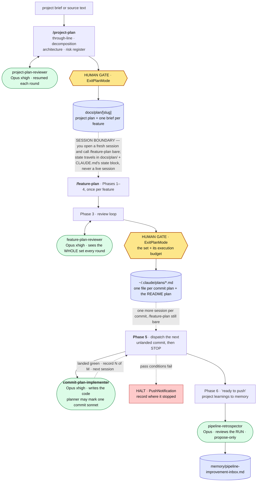
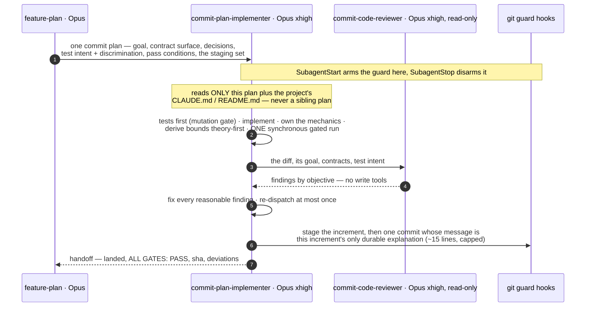
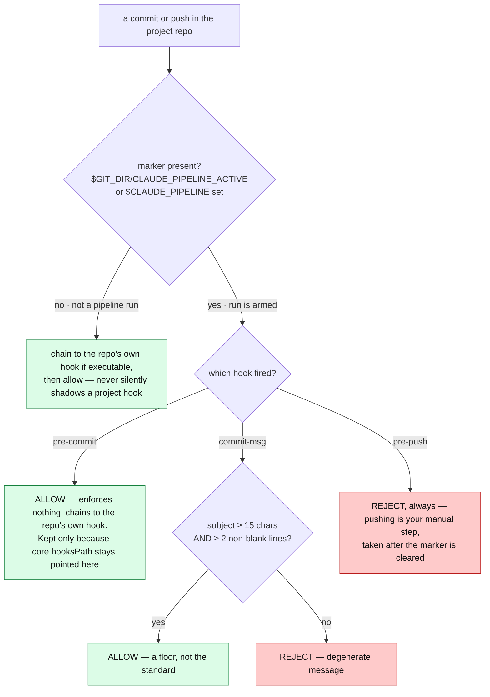

# The planning pipeline — a visual map

**This file is a map, not an agreement.** It shows the shape of the ecosystem: who dispatches whom,
where the human gates sit, what each artifact path is. It carries **no rule of its own** — every rule
is owned by the file named beside it. When the map and a governing file disagree, the file wins and
this map is stale. To change anything, invoke **`/pipeline-maintenance`**.

> Verified against the files on **2026-08-08** (second pass; Claude Code 2.1.222). Re-check with
> `validate-config.sh` (wiring) and `pipeline-stats.py <project>` (what a run cost), both in
> `skills/pipeline-maintenance/`. Ecosystem files ride the `~/.dotfiles` bare repo — an edit is live
> nowhere else until `/dotfiles-sync` has pushed it.

---

## 1. The 30-second version

The ladder is **project → feature → commit**. Everything is automated except four human steps:

| # | You do | Then the pipeline |
|---|--------|-------------------|
| 1 | Fresh session → **`/project-plan`** on the brief → approve at `ExitPlanMode` | Persists the project plan + one **feature brief** per feature to `docs/plan/` |
| 2 | New session in the project repo → **`/feature-plan`** with **no arguments** → approve the commit-plan set **and its execution budget** | Derives the next feature from `CLAUDE.md`'s state block, announces it, plans and hardens the whole set, persists it, opens the state record — then stops |
| 2b | **One more session per commit** → **`/feature-plan`**, still bare, until the feature lands | Dispatches the next unlanded commit, gates it green, records *N of M landed*, stops. Interruption lands between commits, never inside one |
| 3 | Wait for **"ready to push"** → review the local commits → **push by hand** | Nothing — the guard blocks a *dispatched implementer* from pushing, deliberately |
| 4 | **`/pipeline-maintenance`** when the improvement inbox has items | Reads the inbox, asks what it must, then applies proposals **with you present** and pushes via `/dotfiles-sync` |

Step 2's `ExitPlanMode` is **the only gate between a plan and code being written**.

---

## 2. End to end

Rounded green = subagent, yellow hexagon = human gate, cylinder = durable artifact, dotted = a real
session boundary.

---

## 3. Who owns what — the altitude contract

Each rung owns exactly one thing and copies nothing from another. A copy upstream is not a head
start; it is a second source of truth that drifts the moment the real one is decided.

| Rung | Owns | Must never contain |
|------|------|--------------------|
| **project-plan** | Through-line · decomposition into features · repo architecture · cross-cutting conventions · risk register · falsifier per feature · a per-feature **delta** | Call signatures, schemas, code bodies, stubs, tolerances, sample sizes — a delta names **modules, never signatures** |
| **feature-plan** | Decomposition into commits · the **contract surface** between them · pre-resolved decisions *with rejected alternatives* · each test's **intent / target / method class / discrimination** · declared **deltas** · the effort estimate · the **staging set** (§8) | Code bodies, **test mechanics** (expressions, fixtures, grid sizes, loops), numeric bounds and tolerances, **the commit message** |
| **commit-plan-implementer** | **Code bodies** · **all test mechanics** · **every numeric bound**, derived theory-first · verification · the commit **and its message** | — (it reads only its one plan; never the project plan or a sibling) |

Two rules sit behind this table: *why the plan carries no code*, and *measurement splits by question,
not by rung* — the planner may measure only to certify a gate **discriminates**, and writes the
margin, never the tolerance. Both owned by `skills/feature-plan/SKILL.md` ("What the plan pins",
"Measuring during planning"); `feature-plan-reviewer` enforces both.

---

## 4. Inside one commit

The implementer is the only node with repo write access and makes the most judgment calls of any of
them — hence the tersest agreement in the ecosystem. It never pushes and never returns mid-workflow;
a dispatch returning *without* its commit landed is resumed, not halted and not re-dispatched cold
(`skills/feature-plan/SKILL.md`, Phase 5).

---

## 5. The git guard

**Nobody arms it by hand.** `hooks/pipeline-marker.sh` is wired in `settings.json` as a
`SubagentStart`/`SubagentStop` pair matching `^commit-plan-implementer$`, so the guard is live for
exactly the window a dispatched implementer is touching the repo: your own pushes are never blocked
between commits, and a halt cannot strand an armed marker. Enforcement stays at the git layer because
it catches a commit by **any** route, not only one made through Bash.

---

## 6. File index — who owns what, and what it produces

| File | Role · model · effort | Produces |
|------|----------------------|----------|
| `skills/project-plan/SKILL.md` | Project planner · main session | `docs/plan/[slug]`; dispatches `project-plan-reviewer`, `Explore` (Sonnet) |
| `skills/feature-plan/SKILL.md` | Feature planner + **one commit per session** · main session | `~/.claude/plans/*.md`; dispatches `feature-plan-reviewer`, `Explore` (Sonnet), `commit-plan-implementer` ×1/session, `pipeline-retrospector` |
| `skills/pipeline-maintenance/SKILL.md` | Meta-skill: edits the ecosystem · main session | the ecosystem files + the memories → `dotfiles-sync` |
| `skills/dotfiles-sync/SKILL.md` | Distributes the ecosystem · main session | the commit + push that makes an edit live elsewhere |
| `agents/project-plan-reviewer.md` | Critic of the project plan · Opus xhigh | reports only · **persistent, resumed each round** |
| `agents/feature-plan-reviewer.md` | Critic of the whole commit-plan set · Opus xhigh | reports only · **persistent, resumed each round** |
| `agents/commit-plan-implementer.md` | Executes one commit plan · **Opus xhigh**, planner may mark a routine commit `model: sonnet` (§0) | code + one local commit **and its message** — the increment's only durable explanation; dispatches the reviewer, and the README writer on the last increment |
| `agents/commit-code-reviewer.md` | Independent review of one diff · Opus xhigh · **read-only** | reports only · **one-shot per commit** |
| `agents/feature-readme-writer.md` | Authors the showcase README — **what the work revealed**, not how it is built · Opus high | feature `README.md` · dispatched **last** · does not stage or commit |
| `agents/pipeline-retrospector.md` | Retrospective on the run · Opus high | the inbox + metrics memories **only** |
| `skills/{reviewer,handoff}-core/` | Shared discipline · **preloaded** via `skills:` frontmatter | — · `handoff-core` is invoked (not preloaded) by `feature-plan`, which is a skill |
| `skills/reader-profile/` | Calibration of explanation for the operator as reader — not a role discipline, hence not a `-core` | — · **preloaded** into both plan reviewers, the implementer and the README writer; **invoked** by `project-plan` step 0 and `feature-plan` Phase 1. Governs shipped artifacts only; an artifact's own agreement wins on audience |
| `skills/pipeline-maintenance/{validate-config.sh, pipeline-stats.py}` | The two check scripts · POSIX sh / Python 3 | *is the config still wired* (exit 1 on an unresolvable reference; run by post-edit check 6 **and** `feature-plan` Phase 1) · *what the last run cost* (tokens, turns, reviews, peak context, per tier and commit) |
| `hooks/pre-commit`, `pre-push`, `commit-msg`, `pipeline-marker.sh` | The git guard · POSIX sh | allow or reject · marker-gated, see §5 |

One artifact has **more than one owner**, and they must agree: the project's `CLAUDE.md`
**pipeline-state block** — *seeded* by `project-plan` step 4, *written* by `feature-plan` Phases 4,
5 (every dispatch, and the halt path) and 6, *read* by `feature-plan`'s own invocation. **This is
what lets step 2 be called bare.**

---

## 7. How the pipeline improves itself

At feature close, `feature-plan` Phase 6 dispatches `pipeline-retrospector`: it measures the run with
`pipeline-stats.py`, appends a row to `memory/pipeline-metrics.md`, and files proposals to
`memory/pipeline-improvement-inbox.md`. It **proposes only** — the ecosystem files govern every future
run and a run closes unattended, so editing them here would change behaviour with nobody reading the
diff. `/pipeline-maintenance` consumes and reconciles the queue with you present; an item left in the
inbox resurfaces next cycle, which is the point.

---

## 8. Something went wrong — where to look

| What you see | Owner |
|--------------|-------|
| `pre-push: push blocked during a pipeline run` | An implementer dispatch is still running. If nothing is, a `SubagentStop` hook did not fire — clear `$(git rev-parse --git-dir)/CLAUDE_PIPELINE_ACTIVE` by hand |
| `commit-msg: write a real commit message` | Subject under 15 chars, or no body — `hooks/commit-msg`. The guard is only a floor; the standard is `agents/commit-plan-implementer.md` → "Write the commit message" |
| `pipeline-marker: this repo sets core.hooksPath=…` | The repo owns its hooks path, so the guard is **not** enforcing — `hooks/pipeline-marker.sh` |
| A commit message reads like a run log, or a trivial commit got fifteen lines | `agents/commit-plan-implementer.md` → "Write the commit message" (the cut list and the ~15-line cap) |
| The README reads like implementation docs — a component table, an API reference | `agents/feature-readme-writer.md` → "What the README is about"; those are hard exclusions, not preferences |
| The project plan is a wall of prose, or a brief outgrew its eight fields | `skills/project-plan/SKILL.md` — "How the plan reads". `project-plan-reviewer` must fault the form, not only the content |
| A plan contains code bodies, test expressions, or tolerances | The altitude contract, §3. `feature-plan-reviewer` must fault their *presence*, not only their absence |
| Every commit ran at the same tier | The `model: sonnet` downgrade was never marked — `feature-plan` §0 + `feature-plan-reviewer`'s discrimination objective, which faults a set that marks nothing |
| An implementer preserved something redundant "because the plan pinned it" | Plan-stated mechanics are the implementer's to replace — `agents/commit-plan-implementer.md` |
| A subagent reports `/code-review` or `/verify` failed with `disable-model-invocation` | Expected: both are user-triggered only. `commit-code-reviewer` replaces the first; drive the flow directly instead of the second |
| A reviewer or writer ignores its shared core | The `skills:` preload was skipped (missing/renamed core, or one setting `disable-model-invocation`) and only warns in the debug log — `validate-config.sh` catches it before a run |
| A doc explains a prerequisite the reader owns, grades difficulty, or ranks sections by interest | `skills/reader-profile/` — §2's ledger and §6's no-verdict clause. If it is a **README**, this is expected: its reader is a newcomer, and its own agreement wins on audience |
| A plan or agent file grew a `skills:` block that does nothing | `skills:` is subagent-only; a skill preloads nothing. Invoke via the `Skill` tool — `validate-config.sh` now errors on this |
| `/feature-plan` opens by reporting a config failure | `validate-config.sh` found an unresolvable reference. Fix it in `/pipeline-maintenance`, not mid-run |
| A commit seems to have stalled | Check the plan's §0 **agent wall-clock** estimate — not its compute figure, which is far smaller and makes every healthy dispatch look stalled |
| A dispatch came back saying it is "waiting" | Usually a **backgrounded** dispatch — subagents background by default unless the `Agent` call passes `run_in_background: false`. Rule owned by `skills/handoff-core/`; recovery by `feature-plan` Phase 5 |
| The implementer skipped its code review, or wrote the feature README itself | Check `CLAUDE_CODE_MAX_SUBAGENT_SPAWN_DEPTH`. The pipeline needs depth ≥ 2; at the limit the harness withholds the `Agent` tool rather than erroring — `/pipeline-maintenance`, "The dispatch shape" |
